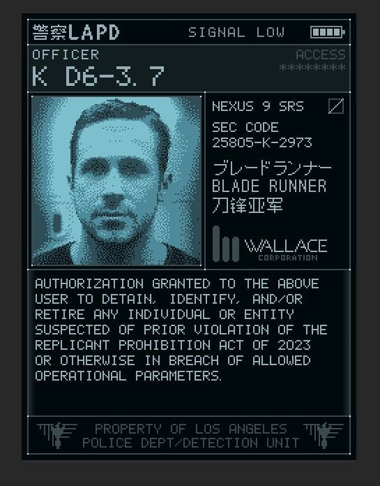

 <h1>Hi! Welcome to my Github, I'm SadNap</h1>

  

##
🛠️ Skill:

👨‍💻Work:
Currently working on the **AuctionSystem** project for **C# BackEnd** Intern-Junior level practice, utilizing **Swagger** for API documentation, **Redis** for caching/data storage, and **Docker** for containerization.

During the development process, I am using the following tools and frameworks:

- *BackEnd:** C# / .NET, Entity Framework Core, PostgreSQL, **Redis**
- **FrontEnd:** JavaScript (JS), HTML, CSS, Razor Pages / Razor Components
- **Tools:** **Swagger**, Docker

The template used is ASP.NET Core MVC (to potentially add a UI in the future).

🌱learning:
- EF core, SQL, Redis all about BackEnd
- In the future, I plan to start learning C++ and Java.
🔥 Most used languages:
- So far only C#)
