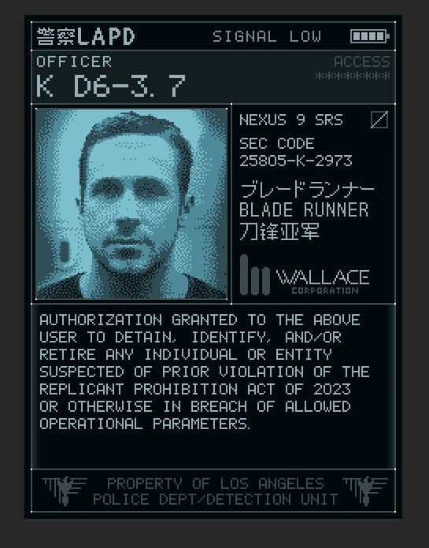

  <h1>👋 Hi! Welcome to my GitHub, I'm Daniil</h1>

  

## 🛠️ Tech:

## 💼 EXPERIENCE AND PROJECTS

### C# BACKEND DEVELOPER (1.5 years of experience)

#### 📖 Key areas of expertise:

* **Backend Developer (Startup Project)**
    * **API Development:** Розробка REST-контролерів та сервісів для бізнес-логіки (маркетплейс).
    * **Database:** Проєктування схем та керування міграціями БД через EF Core.
    * **Teamwork:** Досвід роботи в команді, використання Git для спільної розробки.
    * **Tools:** Налаштування Swagger та тестування API через Postman.

* **Unity Developer (Indie Game Studio)**
    * **Gameplay Mechanics:** Розробка систем переміщення, стрільби та логіки взаємодії.
    * **Mobile Development:** Створення ігрових механік для Android (Play Market).

---

## 🛠 Skills & Technology Stack

### 🚀 Backend & Core

### 📚 Currently Learning (Active Focus)
> *Expanding my backend expertise with new languages and enterprise databases.*

### 🎨 UI & Desktop
* **Cross-platform:** `Avalonia UI`
* **Windows Ecosystem:** `WPF (XAML)`, `WinForms`
* **Frontend:** `React.js`

### ⚙️ Infrastructure & Tools

